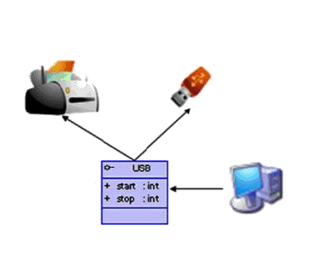

[[JAVA]]_10_

# 关键字：static

当我们编写一个类时，其实就是描述其对象的属性和行为，而并没有产生实质上的对象，只有通过new关键字才会产生出对象，这时系统才会分配内存空间给对象，其方法才可以提供外部调用。我们有时候希望无论是否产生对象或无论产生了多少对象的情况下，
***某些特定的数据在内存空间里只有一份***。
例如所有的中国人都有个国家名称，每一个中国人都共享这个国家名称，不必在每一个中国人的实例对象中都单独分配一个用于代表国家名称的变量。*节省内存！*

# 关键字 abstract

### 1.可以用来修饰：类、方法

### 2.具体的：

- abstract修饰类：抽象类

> 此类不能实例化  
> 抽象类中一定有构造器，便于子类实例化时调用（涉及：子类对象实例化的全过程）  
> 开发中，都会提供抽象类的子类，让子类对象实例化，完成相关的操作 -->抽象类的前提：继承性

- abstract修饰方法：抽象方法

> 抽象方法中方法的声明，没有方法体  
> 包含抽象方法的类，一定是一个抽象类。反之，抽象类中可以没有抽象方法的。  
> 若子类重写了父类中的所有抽象方法，此子类方可实例化。  
> 若子类没有重写父类中的所有抽象方法，则此类也是一个抽象类，需要使用abstract修饰

### 3.注意点：

- 1.abstract不能用来修饰：属性、构造器等结构
- 2.abstract不能用来修饰私有方法、静态方法、final的方法、final的类

### 4.abstract的应用举例：

- 举例：IO流中设计到的抽象类：InputStream/OutputStream/Reader/Writer。在其内部定义了抽象的read()、write()方法。

# 关键词：interface

### 1.使用说明：

- 1.接口使用interface来定义
- 2.Java中，接口和类是并列的两个结构
- 3.如何定义接口：定义接口中的成员

> 1.JDK7以前：只能定义全局常量和抽象方法
>
> > 全局常量：public static final，但是书写时，可以省略  
> > 抽象方法：public abstract,书写时，也可以省略
>
> 2.JDK8及以后：除了定义全局常量和抽象方法以外，还可以定义静态方法、默认方法。

- 4.接口中不能定义构造器！意味着接口不可以实例化
- 5.Java开放中，接口通过让类去实现(implements)的方式来使用。

> 如果实现类覆盖了接口中的所有抽象方法，则此实现类就可以实例化  
> 如果实现类没有覆盖接口中所有的抽象方法，则此实现类仍为一个抽象类

- 6.Java类可以实现多个接口 -->弥补了Java单继承性的局限性。

> 格式：class AA extends BB implement CC,DD{}

- 7.接口与接口之间可以继承，而且可以多继承
- 8.接口的具体使用，体现多态性
- 9.接口，实际上可以看做一种规范

### 2.举例：



```java
public class USBTest {
    public static void main(String[] args) {
        Computer computer = new Computer();
        //1.创建了接口的非匿名实现类的非匿名对象
        System.out.println("******");
        Flash flash = new Flash();
        computer.transferDate(flash);//声明的是USB，实现的是USB的对象
        //2.创建了接口的非匿名实现类的匿名对象
        System.out.println("******");
        computer.transferDate(new Printer());
        //3.创建了接口的匿名实现类的非匿名对象
        System.out.println("******");
        USB phone = new USB() {
            @Override
            public void start() {
                System.out.println("手机开始工作");
            }

            @Override
            public void stop() {
                System.out.println("手机结束工作");
            }
        };
        computer.transferDate(phone);
        //创建了接口的匿名实现类的匿名对象
        System.out.println("*******");
        computer.transferDate(new USB() {
            @Override
            public void start() {
                System.out.println("匿名实现类中的start方法");
            }

            @Override
            public void stop() {
                System.out.println("匿名实现类中的stop方法");
            }
        });
    }
}

class Computer {
    public void transferDate(USB usb) {
        usb.start();
        System.out.println("具体传输的细节");
        usb.stop();
    }
}

interface USB {
    //常量：定义了长、宽、最大最小传输速度等
    void start();

    void stop();
}

class Flash implements USB {

    @Override
    public void start() {
        System.out.println("U盘开始工作");
    }

    @Override
    public void stop() {
        System.out.println("U盘结束工作");
    }
}

class Printer implements USB {

    @Override
    public void start() {
        System.out.println("打印机开始工作");
    }

    @Override
    public void stop() {
        System.out.println("打印机结束工作");
    }
}
```

##### 体会：

> 1.接口使用上也满足多态性  
> 2.接口，实际上就是定义了一种规范  
> 3.开发中，体会面向接口编程！

### 3.面向接口编程思想

java.sql API  
面向接口编程：我们在应用程序中，调用的结构都是JDBC中定义的接口，不会出现具体某一个数据库厂商的API。

### 4.Java8中关于接口的新规范

- 知识点1：接口中定义的静态方法，只能通过接口来调用
- 知识点2：通过实现类的对象，可以调用接口中的默认方法。如果实现类重写了接口中的默认方法，调用时，仍然调用的是重写以后的方法。
- 知识点3：如果子类（或实现类）继承的父类和实现的接口中声明了同名同参数的默认方法，那么子类在没重写此方法的情况下，默认调用的是父类中的同名同参数的方法。 -->类优先原则
- 知识点4：如果实现类实现了多个接口，而这多个接口中定义了同名同参数的默认方法，那么在实现类没重写此方法的情况下，报错。 -->接口冲突，这就需要我们必须在实现类中重写此方法
- 知识点5：如何在子类（或实现类）的方法中调用父类、接口中被重写的方法

```
public void myMethod(){
    method3();//调用自己定义的重写的方法
    super.method3();//调用的是父类中声明的方法
    //调用接口中的默认方法
    CompareA.super.method3();
    CompareB.super.method3();
        }
```

### 5.抽象类和接口的异同

- 相同点：
    - 不能实例化；都可以包含抽象方法的
- 不同点：
    - 把抽象类和接口的定义、内部结构解释说明
    - 类体现单继承性，接口：多继承
    - 类与接口：多实现

# 内部类

### 1.定义：

Java中允许将一个类A声明在另一个类B中，则类A就是内部类，类B称为外部类

### 2.内部类的分类：

成员内部类（静态、非静态） VS 局部内部类（方法内、代码块内、构造器内）

### 3.成员内部类的理解：

> 一方面，作为外部类的成员：
> > 调用外部类的结构  
> > 可以被static修改  
> > 可以被4种不同的权限修饰
>
> 另一方面，作为一个类：
> > 类内可以定义属性、方法、构造器等  
> > 可以被final修饰，表示此类不能被继承，言外之意，不使用final，可以被继承  
> > 可以被abstract修饰

### 4.成员内部类

- 如何创建成员内部类的对象？（静态的、非静态的）

```
//创建Dog实例（静态的成员内部类）：
Person.Dog dog=new Person.Dog();
//创建Bird实例（非静态的成员内部类）：
Person person=new Person();
Person.Bird bird=person.new Bird();
```

- 如何在成员内部类中调用外部类的结构？

```
class Person{
    String name="小明";
    //非静态成员内部类
    class Bird{
        String name="杜鹃";
        public void display(String name) {
        System.out.println(name);//方法的形参
        System.out.println(this.name);//内部类的属性
        System.out.println(Person.this.name);//外部类的属性  
        }
    }
}
```

### 5.局部内部类的使用：

```java
public class InnerClassTestOne {
    //开发中很少见
    public void method() {
        //局部内部类
        class AA {

        }
    }

    //返回一个实现了Comparable接口的类的对象
    public Comparable getComparable() {
        //创建一个实现了Comparable接口的类：局部内部类
        //方式一：
        //class MyComparable implements Comparable {
        //
        //    @Override
        //    public int compareTo(Object o) {
        //        return 0;
        //    }
        //}
        //return new MyComparable();

        //方式二：
        return new Comparable() {
            @Override
            public int compareTo(Object o) {
                return 0;
            }
        };
    }
}
```

### 6.注意点：

在局部内部类的方法中（比如：show）如果调用局部内部类所声明的方法（比如：method）中的局部变量（比如：num）必须为final的  
JDK7及之前版本，要求此局部变量显式的声明为final的  
JDK8及以后版本，可以省略final

### 7.总结

- 成员内部类和局部内部类，在编译以后，都会生成字节码文件。
- 格式 ：
    - 成员内部类：内部类$内部类名.class
    - 局部内部类：外部类$数字 内部类名.class
