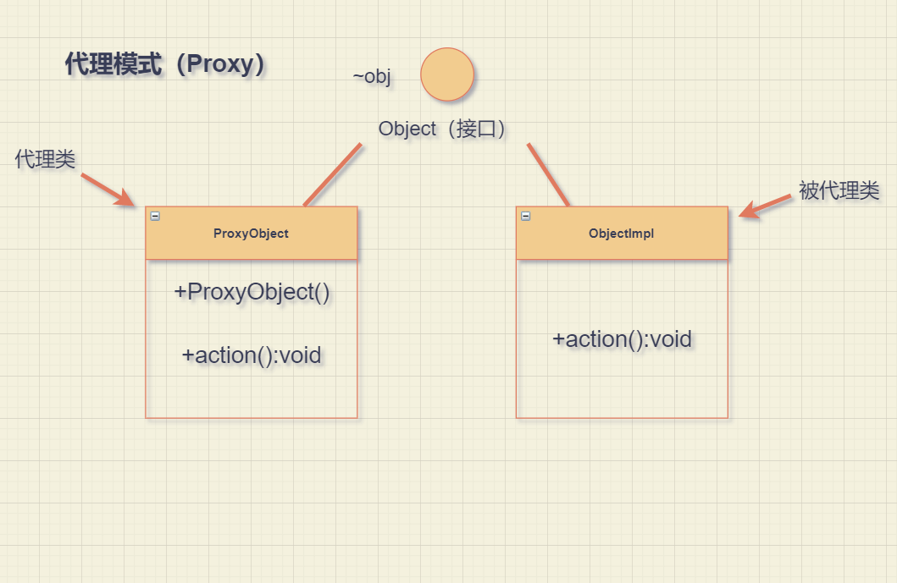

#概述：
代理模式是Java开发中使用较多的一种设计模式。代理设计就是为其他对象提供一种代理以控制对这个对象的访问。

## 应用场景
> 安全代理：屏蔽对真实角色的直接访问。
> 
> 远程代理：通过代理类处理远程方法调用（RMI）。
> 
> 延迟加载：先加载轻量级的代理对象，真正需要再加载真实对象。比如开发一个大文档查看软件，
大文档中有大的图片，有可能一个图片有100MB，在打开文件时，不可能将所有的图片都显示出来，这样就可以使用代理模式，
当需要查看图片时，用proxy来进行大图片的打开。

## 分类

> 静态代理：（静态定义代理类）
> 
> 动态代理：（动态生成代理类）-->JDK自带的动态代理，许哟啊反射等知识

@import ""